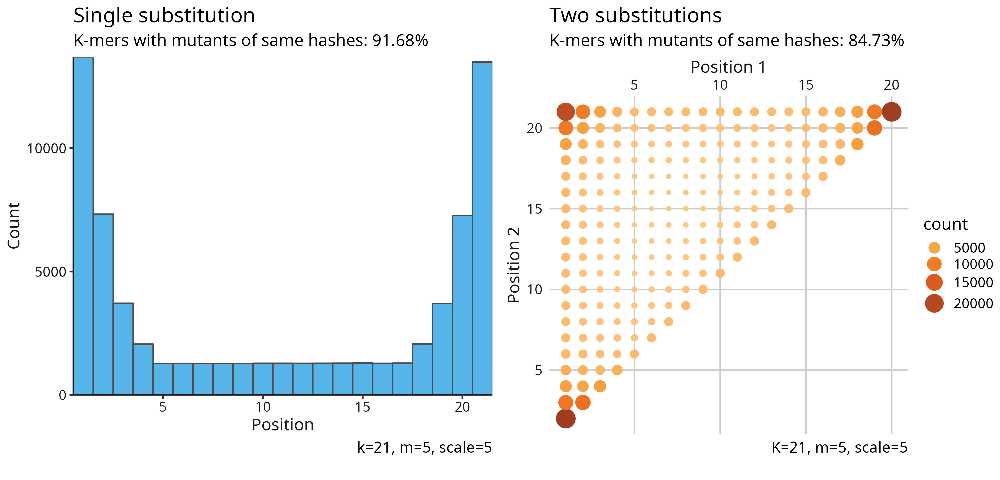
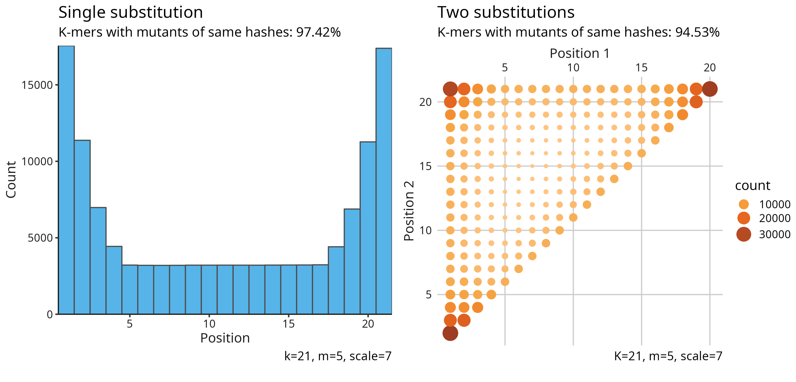
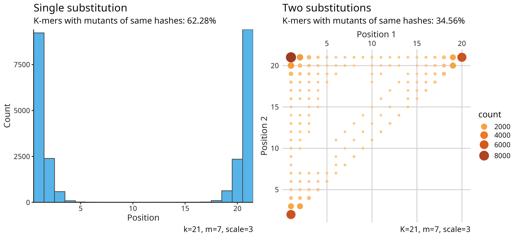
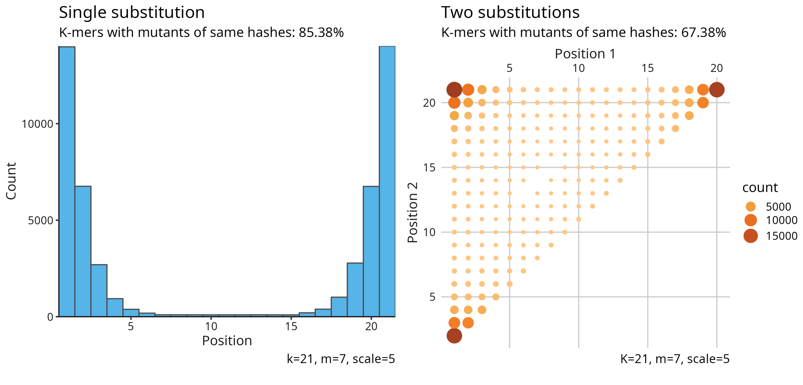
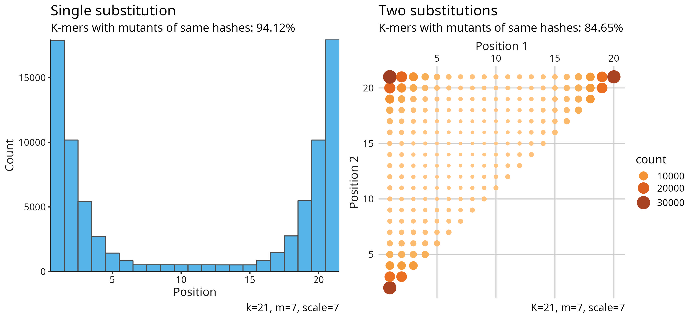

# SimHash evaluation

I implement a [SimHash hash function](https://github.com/shenwei356/bio/tree/master/sketches)
for nucleic acid k-mers, combining SimHash and FracMinHash. 

Reference:
- [Similarity estimation techniques from rounding algorithms](https://dl.acm.org/doi/10.1145/509907.509965)
- [BLEND: A Fast, Memory-Efficient, and Accurate Mechanism to Find Fuzzy Seed Matches](https://arxiv.org/abs/2112.08687)
- [Lightweight compositional analysis of metagenomes with FracMinHash and minimum metagenome covers](https://www.biorxiv.org/content/10.1101/2022.01.11.475838v2)

### Distribution of subsitutions which result in same hashes

### Steps

    # fs=A.muciniphila-ATCC_BAA-835.fasta.gz
    # seqkit subseq -r 1:10000 A.muciniphila-ATCC_BAA-835.fasta.gz > t.fna
    
    fs=t.fna
    
    k=21
    
    for m in 4 5 6; do
        for s in 4 5 6 7 8; do
            go run mutate.go $fs $k $m $s 1 | pigz -c > $fs.simhash-k$k-m$m-s$s-n1.tsv.gz
            go run mutate.go $fs $k $m $s 2 | pigz -c > $fs.simhash-k$k-m$m-s$s-n2.tsv.gz
            
            Rscript site-dist.R -k $k -m $m -s $s $fs.simhash-k$k-m$m-s$s-n1.tsv.gz $fs.simhash-k$k-m$m-s$s-n2.tsv.gz
        done
    done
    
